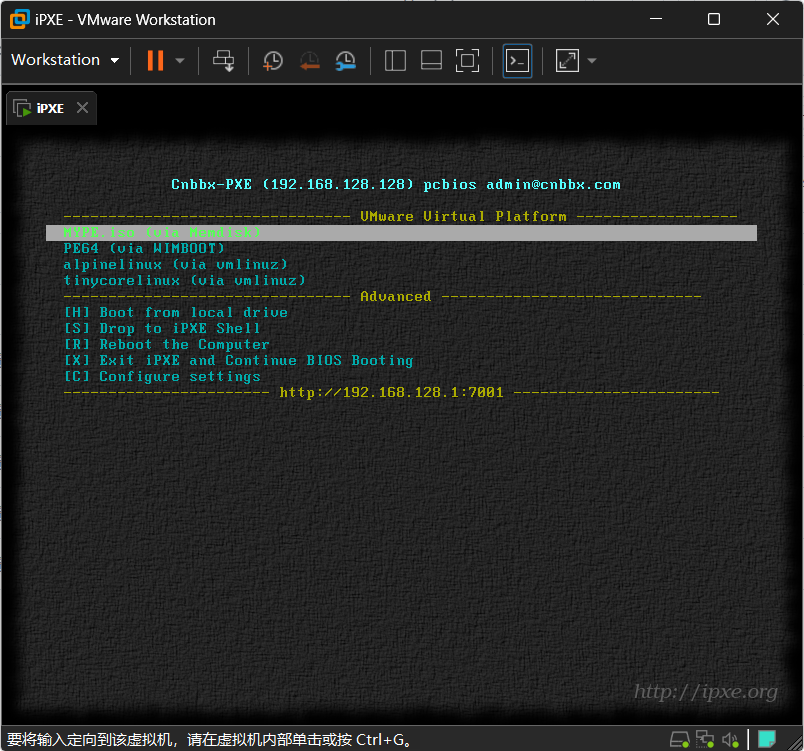

# iPXE 构建项目

## 项目简介

本项目提供了一个 GitHub Actions 工作流，用于从官方 iPXE 源码构建 iPXE 固件并嵌入自定义的 `autoexec.ipxe` 自动执行脚本。

## 功能特性

- 从官方 iPXE 仓库（`ipxe/ipxe`）构建
- 从当前仓库获取自定义的 `autoexec.ipxe` 脚本和 `ca.crt` 证书文件
- 构建多种格式的 iPXE 固件：`undionly.kpxe`、`ipxe.pxe`、`ipxe.iso`、`ipxe.dsk`、`ipxe.lkrn`、`ipxe.usb` 等
- 支持构建 i386 和 x86_64 两种架构的固件
- 自动上传构建产物作为 GitHub Actions artifacts
- 自动生成带时间戳的 release tag

## 使用方法

### 通过 GitHub Actions 手动触发

1. 进入本仓库的 GitHub Actions 页面
2. 选择 "构建 iPXE 并嵌入自动执行脚本" 工作流
3. 点击 "Run workflow" 按钮
4. 填写以下参数：
   - `autoexec_path`: 需要启动执行的脚本（默认：`autoexec.ipxe`）
5. 点击 "Run workflow" 开始构建

### 构建产物

构建完成后，工作流会上传以下构建产物：

- `{arch}-undionly.kpxe`: 通用网络启动固件
- `{arch}-ipxe.pxe`: PXE 格式固件
- `{arch}-ipxe.iso`: ISO 格式固件
- `{arch}-ipxe.dsk`: 磁盘格式固件
- `{arch}-ipxe.lkrn`: Linux 内核格式固件
- `{arch}-ipxe.usb`: USB 格式固件
- `{arch}-autoexec.ipxe`: 嵌入的自动执行脚本

其中 `{arch}` 为架构名称，包括 `i386` 和 `x86_64`。

## 工作流配置

工作流配置文件位于 `.github/workflows/build.yml`，您可以根据需要修改配置。

### 支持的架构

工作流支持构建以下架构的固件：
- `i386`：32位 x86 架构
- `x86_64`：64位 x86 架构

## 项目结构

项目包含以下目录和文件：

- `.github/workflows/`：GitHub Actions 工作流配置
  - `build.yml`：构建工作流配置文件
- `img/`：存放项目相关图片资源
  - `pic.png`：项目图片
- `local/`：本地配置文件目录
  - `colour.h`、`console.h`、`crypto.h`、`general.h`、`general.h.efi`：iPXE 本地配置文件
- `autoexec.ipxe`：自动执行脚本
- `ca.crt`：证书文件
- `README.md`：项目说明文档

## 示例 `menu.ipxe`

以下是一个简单的 `menu.ipxe` 示例：

```ipxe
#!ipxe

# 显示欢迎信息
echo 正在启动 iPXE...

# 网络配置
ifopen net0

# 启动菜单
menu iPXE 启动菜单
item linux 启动 Linux
item windows 启动 Windows
item shell 进入 iPXE shell
choose --default linux --timeout 10000 target && goto ${target}

:linux
echo 正在启动 Linux...
# 这里添加启动 Linux 的命令
goto end

:windows
echo 正在启动 Windows...
# 这里添加启动 Windows 的命令
goto end

:shell
shell
goto end

:end
echo 启动完成！
```

## 注意事项

- 确保 `autoexec.ipxe` 和 `ca.crt` 文件存在于项目根目录，否则构建会失败
- 构建过程可能需要几分钟时间，请耐心等待
- 如果构建失败，请检查工作流日志以了解详细错误信息

## autoexec.ipxe 加载顺序

当 iPXE 固件启动时，它会执行内置的 `autoexec.ipxe` 脚本（本项目构建的固件会包含自定义的 `autoexec.ipxe`）。该脚本的执行流程如下：

1. **初始化**：设置环境变量和显示欢迎信息
2. **网络配置**：尝试通过 DHCP 获取网络配置
3. **自定义配置加载**：按照以下顺序尝试加载配置文件：
   - 基于主机名的配置：`tftp://${tftp-server}/HOSTNAME-${hostname}.ipxe`
   - 基于 MAC 地址的配置（十六进制原始格式）：`tftp://${tftp-server}/MAC-${mac:hexraw}.ipxe`
   - 基于 MAC 地址的配置（带连字符格式）：`tftp://${tftp-server}/MAC-${mac:hexhyp}.ipxe`
4. **默认菜单加载**：如果自定义配置不存在，尝试加载默认菜单：
   - TFTP 方式：`tftp://${tftp-server}/menu.ipxe`
   - HTTP/HTTPS 方式：`http://${boot_domain}/menu.php?mac=${mac:hexraw}` 或 `https://${boot_domain}/menu.php?mac=${mac:hexraw}`
   - HTTP/HTTPS 方式（备用）：`http://${boot_domain}/menu.ipxe` 或 `https://${boot_domain}/menu.ipxe`
5. **错误处理**：如果所有加载尝试都失败，显示错误菜单，提供重启或退出选项

## 相关链接

- [官方 iPXE 项目](https://github.com/ipxe/ipxe)
- [iPXE 文档](https://ipxe.org/docs)

## 项目资源

项目包含以下资源目录：

- `img/`：存放项目相关图片资源
  - `pic.png`：项目图片


